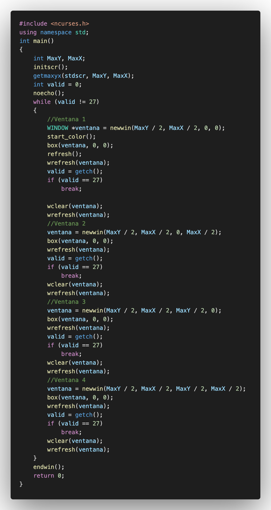
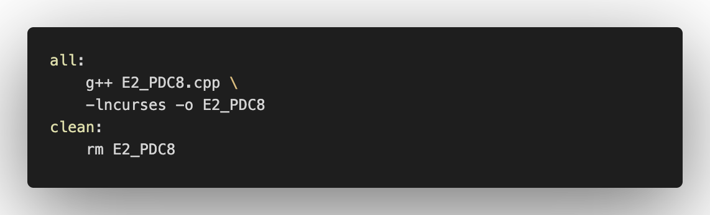
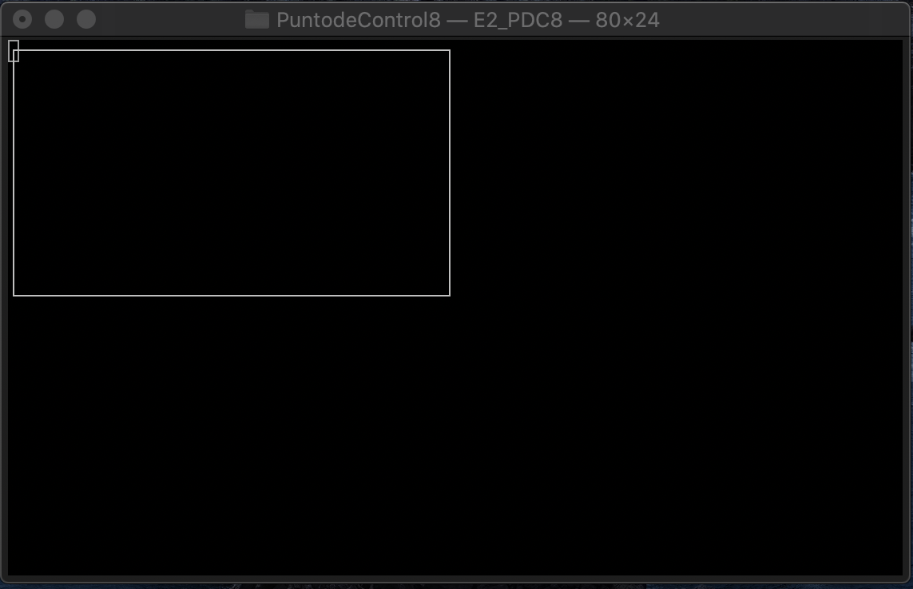
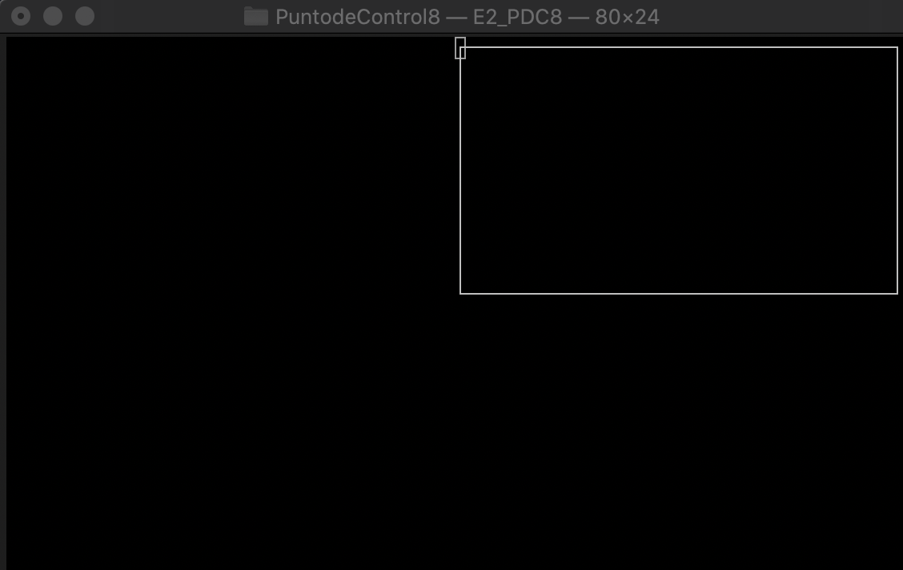
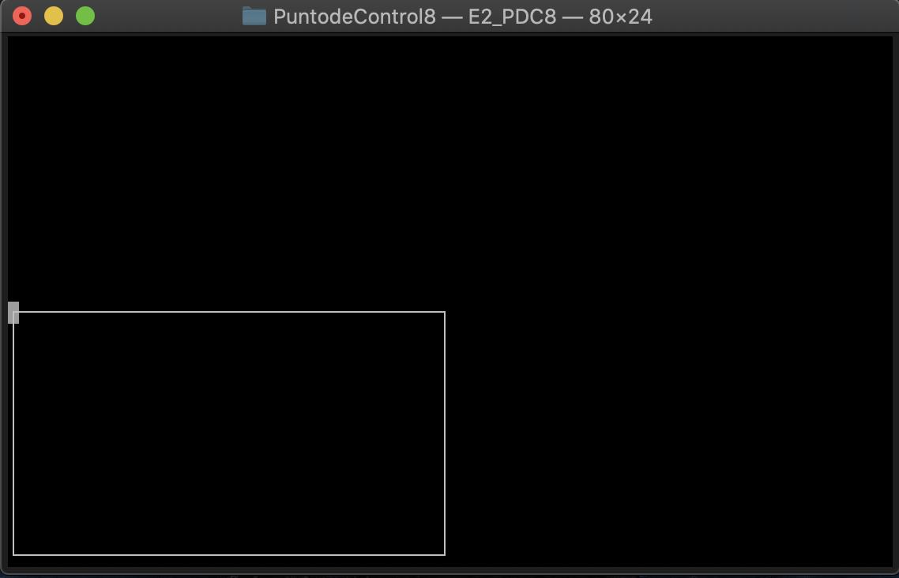
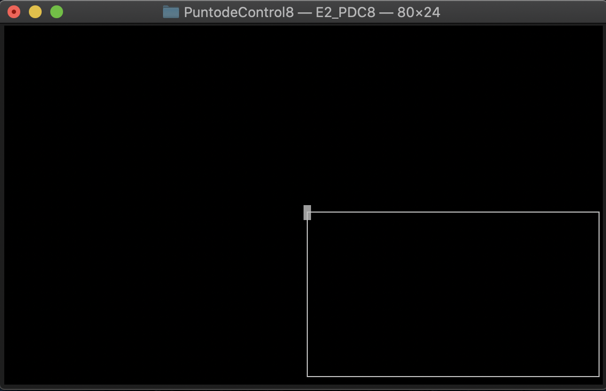

# C++\_PDC#08

## :copyright: Autor

- :older_man: **Jose Fernando Vargas Rodriguez**
- :e-mail: jose.vargasr@unitec.edu
- :link: [github.com/josevargasr](https://github.com/josevargasr)
- :calendar: 2020-09-13 23:00 CST

---

## :dart: Objetivos

Un programa de **C++** diseñado para demostrar:

1. Identificar y comparar los diferentes modos de compilación:
   - **Compilación Normal**
   - **Compilación Compartida**
   - **Compilación Estática**
2. La implementación del makefile en nuestro programa.
3. El uso de la libreria ncurses y sus funciones.

---

## Ejercicio 1

Existen tres modos de compilación, **Normal**, **Compartida** y **Estática**. En cuanto a los tamaños de los archivos generados, los tres modos generan archivos bastante similares en cuanto a tamaño. La compilación **Normal** es de las más comúnes por su simplicidad a la hora de ejecutar el programa. La compilación **Compartida**, en mi opinión, es la más compleja, ya que en el Makefile se copian todos los archivos que se necesitan para ejecutar el programa y se utilizan lineas de código como el **g++ -shared** que es propio de la compilación Compartida. En cuanto a la compilación **Estática**, tiene como ventaja que su tiempo de ejecución es más rápido y el programa se puede llevar a otro ordenador sin necesidad de llevar las librerias.

---

## Ejercicio 2

### E2_PDC8

### Makefile

### Salida

#### Salida 1

#### Salida 2

#### Salida 3

#### Salida 4

## :computer: Código

- :blue_book: [C++\_PDC8](https://github.com/josevargasr/C-_PDC8.git)

---

#### Herramientas:

- :package: [Visual Studio Code](https://code.visualstudio.com/)
- :camera: [Polacode-2020 v0.5.2](https://github.com/jeff-hykin/polacode)
- :notebook: [Markdown Cheatsheet](https://github.com/adam-p/markdown-here/wiki/Markdown-Cheatsheet)
- :smile: [Emoji Cheat Sheet](https://www.webfx.com/tools/emoji-cheat-sheet/)
